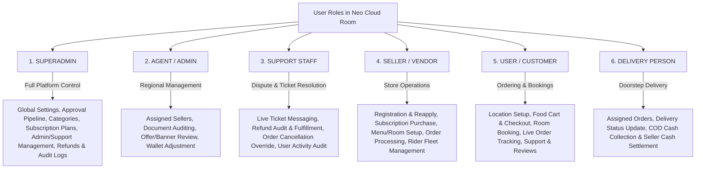
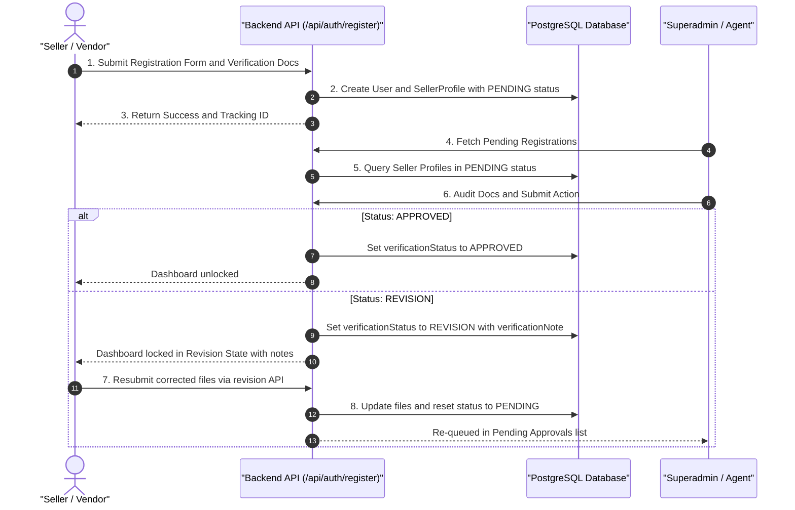
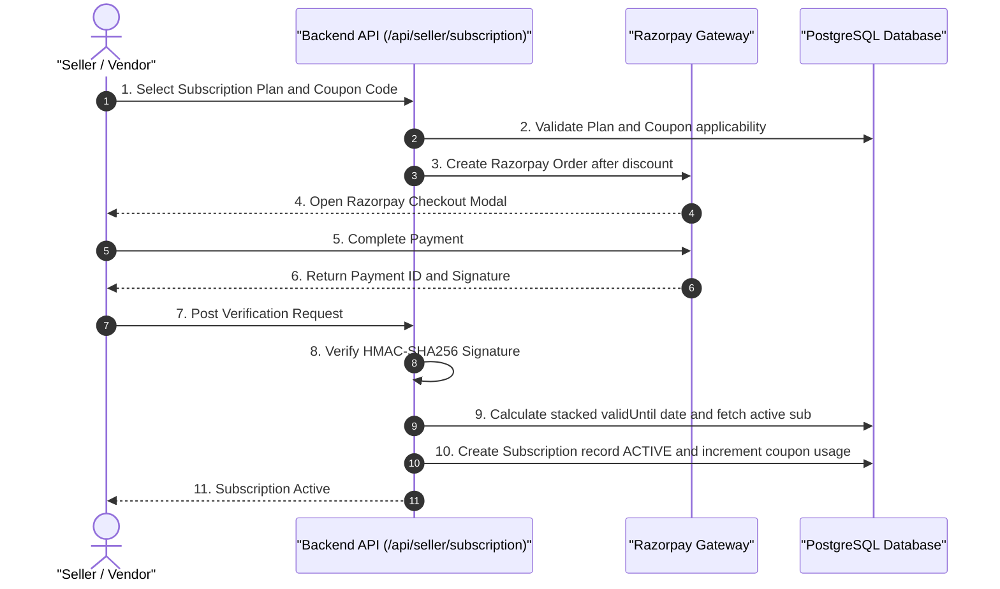
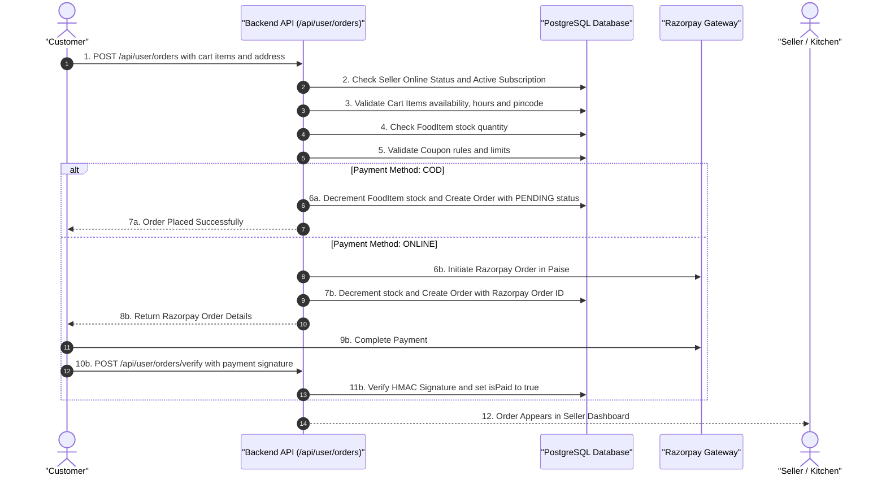
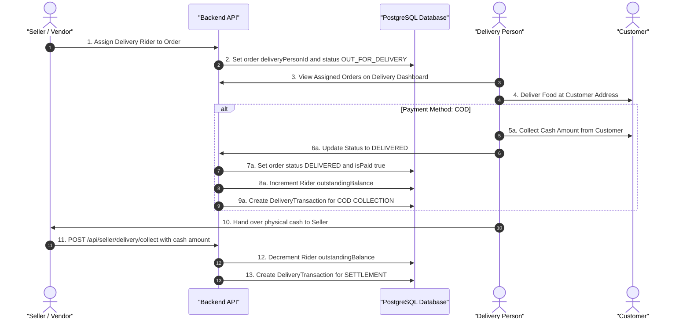
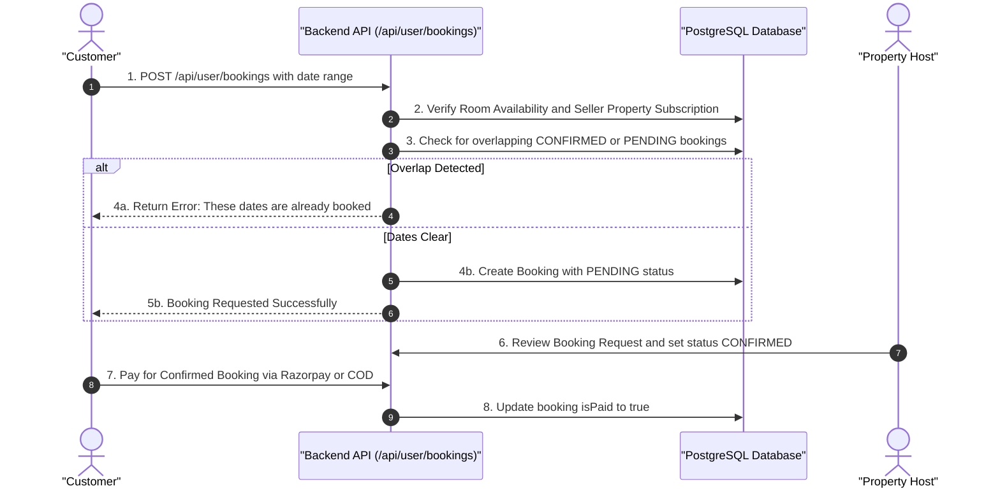
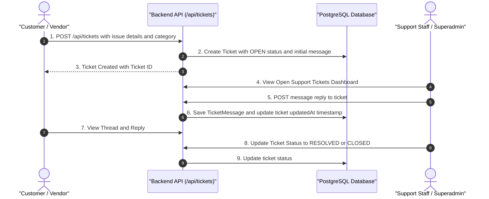
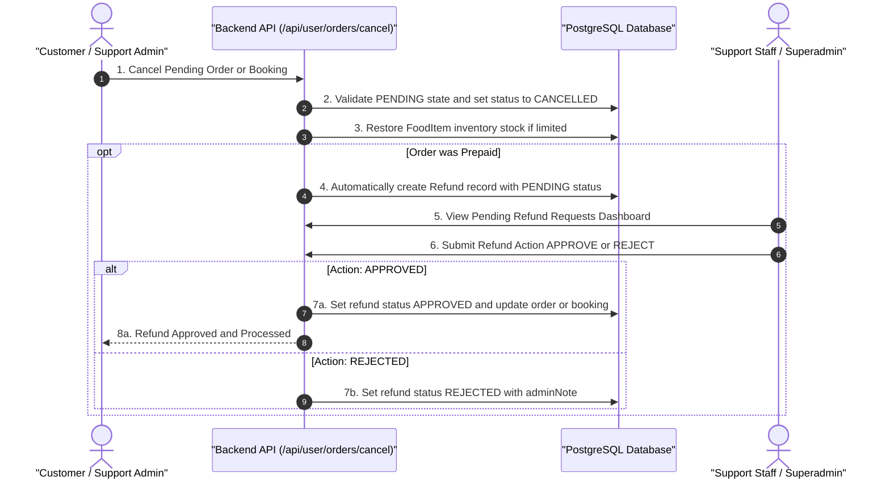
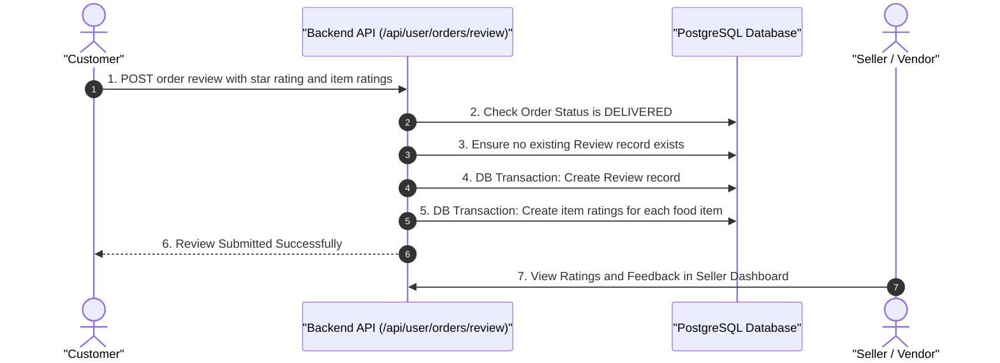
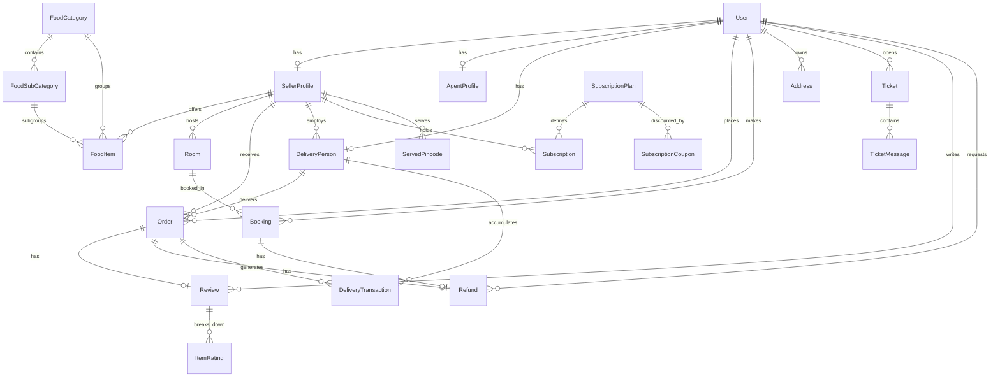

# Neo Cloud Room (CloudKitchen Platform) - Comprehensive System Analysis & Workflow Architecture Document

---

## 1. Executive Summary & Project Architecture

**Neo Cloud Room** (also known as *CloudKitchen*) is a multi-role, multi-vendor, enterprise-grade digital platform designed to handle two primary service domains:
1. **Food & Culinary Services**: Cloud Kitchens, Mess Providers, and Bakeries delivering fresh meals to local customers based on pincodes and real-time menu availability.
2. **Property & Room Rental Services**: Short-term and long-term room listings, capacity management, booking requests, date-conflict validation, and payment settlement.
3. **Furniture Exploration & Direct Store Inquiries**: Showcasing catalog items with query routing.

### Core Technology Stack
- **Frontend**: Next.js 15+ (App Router), React 19, TypeScript, Tailwind CSS, Lucide Icons, Modern Responsive UI.
- **Backend API**: Next.js API Routes (`/api/...`), Node.js, TypeScript, NextAuth.js / JWT Auth.
- **Database & ORM**: PostgreSQL database managed via Prisma ORM (`prisma/schema.prisma`).
- **Payment Processing**: Razorpay Integration (HMAC-SHA256 signature verification for Online payments, COD workflow with rider cash collection).
- **File Storage**: Local & Cloud multipart form upload handler (`lib/upload.ts`) for document verification (Adhaar, FSSAI, Light Bill, Passbook) and media assets (Kitchen, Cuisine, Room photos, Banners).
- **Location & Routing**: Geocoding engine and pincode-matching delivery verification.

---

## 2. Master System Enums & Data States

| Domain | Enum / Field Name | Allowed Values / States | Description |
| :--- | :--- | :--- | :--- |
| **System Roles** | `User.role` | `SUPERADMIN`, `AGENT`, `SUPPORT`, `SELLER`, `USER`, `DELIVERY` | Defines access control permissions and available dashboards. |
| **Seller Business Category** | `SellerProfile.businessCategory` | `FOOD`, `PROPERTY`, `BOTH` | Determines whether the store operates as a Cloud Kitchen/Mess, Room Host, or Both. |
| **Seller Food Type** | `SellerProfile.foodType` | `VEG`, `BOTH` | Defines dietary compliance for food offerings. |
| **Seller Verification** | `verificationStatus` `foodVerificationStatus` `propertyVerificationStatus` | `PENDING`, `APPROVED`, `REJECTED`, `REVISION`, `NONE` | Lifecycle state of vendor document verification and audit resubmission. |
| **Order Status** | `Order.status` | `PENDING`, `PREPARING`, `OUT_FOR_DELIVERY`, `DELIVERED`, `CANCELLED` | Order progression state from placement to delivery. |
| **Payment Method** | `paymentMethod` | `ONLINE`, `COD`, `QR` | Payment channel chosen by customer or rider. |
| **Booking Status** | `Booking.status` | `PENDING`, `CONFIRMED`, `CANCELLED` | Progression state of property room bookings. |
| **Subscription Status** | `Subscription.status` | `ACTIVE`, `EXPIRED`, `INACTIVE` | Vendor subscription state allowing store operational status. |
| **Coupon Status** | `approvalStatus` | `PENDING_APPROVAL`, `APPROVED`, `REJECTED`, `REVISION` | Approval pipeline for seller-created discount coupons and popup banners. |
| **Support Ticket Status** | `Ticket.status` | `OPEN`, `IN_PROGRESS`, `RESOLVED`, `CLOSED` | Progression of customer support tickets. |
| **Refund Request Status** | `Refund.status` | `PENDING`, `APPROVED`, `REJECTED` | Status of money refund resubmissions. |
| **Delivery Transactions** | `DeliveryTransaction.type` | `COD_COLLECTION`, `SETTLEMENT`, `ADJUSTMENT` | Delivery wallet ledger types tracking cash movement between driver and seller. |

---

## 3. Detailed Role-Based Features & Flow Breakdown

### 3.1 SUPERADMIN (Master Platform Administrator)
- **Global Governance**: Complete access to all backend resources and administrative dashboard controls.
- **Verification & Approval Engine**:
  - Reviews and audits initial seller registrations, document attachments (Adhaar, FSSAI, Light Bill, Passbook), resubmissions, and category application expansions.
  - Approves, rejects, or flags resubmissions with administrative notes (`adminNote`).
  - Audits pending seller-requested coupons and pop-up promotional banners (`PENDING_APPROVAL` -> `APPROVED` / `REJECTED`).
- **Category & Taxonomy Management**:
  - Creates and manages top-level platform categories (`FOOD` vs `ROOM`).
  - Creates, edits, and organizes `FoodCategory` and `FoodSubCategory` with image upload handling.
- **Subscription Plan & Coupon Creation**:
  - Configures vendor subscription plans (`SubscriptionPlan`) with parameters: `name`, `price`, `durationMonths`, `category` (`FOOD`, `PROPERTY`, `BOTH`), and JSON feature lists.
  - Creates global or plan-specific `SubscriptionCoupon` codes with percentage or flat discounts, expiry dates, and maximum usage caps.
- **Financial & Refund Management**:
  - Inspects refund resubmissions (`Refund`) for paid orders and room bookings.
  - Approves refunds (triggering status update `isPaid = false` on orders or `status = CANCELLED` on bookings) or rejects requests with transaction references.
  - Monitors system-wide audit logs (`AuditLog`) capturing administrative actions.
- **User, Agent & Support Personnel Governance**:
  - Creates and manages field Agents (`AGENT`) and Customer Support Staff (`SUPPORT`) accounts.
  - Promotes or demotes user accounts, inspects user activity logs, and toggles user active status.

---

### 3.2 AGENT / ADMIN (Field / Branch Administrator)
- **Assigned Seller Management**:
  - Directly manages a subset of assigned seller profiles (`assignedSellers`).
  - Verifies submitted identity cards and regulatory proofs for newly onboarding vendors in their region.
- **Promotions & Banner Operations**:
  - Creates and updates store-level and global pop-up banners.
  - If an Agent creates a global banner, it is queued as `PENDING_APPROVAL` for Superadmin authorization; store-level banners created by agents are auto-approved (`APPROVED`).
- **Fleet Wallet Adjustments**:
  - Adjusts delivery driver outstanding COD balances (`INCREMENT` or `DECREMENT`) with detailed reason logs (`ADJUSTMENT` transactions).

---

### 3.3 SUPPORT STAFF (Customer Support & Refund Operations Administrator)
- **Dedicated Administrative Role**:
  - Created by Superadmin (`role = SUPPORT`) to manage customer support operations, user dispute resolution, and payment refunds via `/auth/login/admin`.
- **Support Ticket Resolution & Live Messaging**:
  - Access to dedicated support ticket dashboard (`/dashboard/support/tickets`).
  - Queries all system-wide support tickets across customers and vendors (`listTickets`).
  - Real-time threaded ticket messaging with users (`sendTicketMessage`), appending staff responses.
  - Ticket lifecycle control: Updates ticket status (`OPEN` -> `IN_PROGRESS` -> `RESOLVED` / `CLOSED`).
  - Ability to create support tickets on behalf of users when handling call/chat inquiries.
- **Refund Request Audit & Money Fulfillment**:
  - Access to refund processing portal (`/dashboard/support/refunds`).
  - Audits pending refund requests (`Refund`) for paid orders and room bookings across the platform.
  - Authorizes refunds (`APPROVED`) or rejects invalid claims (`REJECTED`) with bank transaction references (`transactionId`) and internal administrative notes (`adminNote`).
  - Executing a refund approval automatically updates order payment state (`isPaid = false`) or cancels room bookings (`status = CANCELLED`).
- **Order Inspection & Cancellation Override**:
  - Full access to inspect details of any order (`getOrderDetails`).
  - Administrative authority to cancel problematic or disputed orders (`cancelOrder`), bypassing customer self-cancel constraints and automatically queueing refund requests if the order was prepaid.
- **User Activity Audit**:
  - Inspects registered user list (`/api/superadmin/users`) and monitors individual user activity logs (`/api/superadmin/users/[id]/activity`).
- **Category & Taxonomy Read/Write Access**:
  - Views and updates food categories and subcategories to assist vendors with menu categorization disputes.

---

### 3.4 SELLER / VENDOR (Cloud Kitchen, Mess, Bakery, Room Host)
- **Multi-Step Onboarding & Document Verification Flow**:
  - Registers business profile with business name, seller type (Homely Food, Mess, Bakery), location details (flat, locality, landmark, city, pincode), food classification (`VEG` / `BOTH`), and business category (`FOOD`, `PROPERTY`, `BOTH`).
  - Uploads required legal proofs: Adhaar Card (front & back), FSSAI License, Electricity/Light Bill, Bank Passbook, along with Kitchen, Cuisine, and Room photos.
  - Receives a unique store tracking ID (e.g., `SHOP-X7K2P9`).
- **Reapply / Revision Resubmission Workflow**:
  - If Superadmin/Agent flags profile status as `REVISION` with feedback notes (`verificationNote`), seller dashboard enters Revision Mode.
  - Seller resubmits updated/corrected documents and resends verification request, which resets status to `PENDING` for re-auditing.
- **Category Expansion Application Flow**:
  - Existing approved food sellers can apply to add `PROPERTY` offerings (and vice versa) via `/api/seller/category-application`.
  - Seller submits category-specific proof files (e.g., room photos for property expansion, FSSAI for food expansion). Verification status updates to `PENDING` for that category.
- **Subscription Management & Activation**:
  - Stores require an active `Subscription` matching their operational domain (`FOOD` or `PROPERTY`) to open for orders/bookings.
  - Seller selects plan, applies discount coupons (`SubscriptionCoupon`), and completes Razorpay payment.
  - Stacking logic: Renewing an existing active plan automatically extends the `validUntil` expiry date from the current expiration date.
- **Store & Inventory Controls**:
  - Toggles store Online/Offline state (`isOnline`).
  - Sets day-wise detailed operational hours (`operationalHours` JSON schema containing `isOpen`, `openTime`, `closeTime` for Mon-Sun).
  - Manages served pincodes (`ServedPincode`).
  - Adds/edits food items: Name, description, price, food type (`VEG`/`NON_VEG`), categories, stock quantity (-1 for infinite, or numeric counter with auto-decrement), and item-specific delivery pincodes.
  - Adds/edits room listings: Title, capacity, night price, description, images, and availability status.
- **Order Fulfillment & Delivery Fleet Operations**:
  - Real-time order dashboard tracking statuses: `PENDING` -> `PREPARING` -> `OUT_FOR_DELIVERY` -> `DELIVERED`.
  - Creates dedicated delivery personnel accounts (`DeliveryPerson`) with 10-digit phone verification and login credentials.
  - Assigns delivery riders to specific orders (automatically updates order state to `OUT_FOR_DELIVERY`).
  - Manages COD cash collections: Accepts cash collected by delivery riders, records `SETTLEMENT` transactions, and decrements rider's `outstandingBalance`.
- **Promotions & Reviews**:
  - Requests custom discount coupons and store pop-up banners (submitted for Admin/Superadmin approval).
  - Views order reviews and item-level customer ratings.

---

### 3.5 USER / CUSTOMER
- **Profile & Saved Address Management**:
  - Creates customer account, manages contact information.
  - Saves multiple delivery addresses (`Address`) labeled Home, Work, or Other with pincodes and latitude/longitude geocoding. Sets default delivery address.
- **Multi-Service Catalog Exploration**:
  - Explores nearby food items, mess plans, bakeries, and rooms based on selected delivery pincode.
  - Live system validations prevent selecting offline stores, non-delivering pincodes, or items outside operational store hours.
  - Explores available furniture catalog and submits direct inquiries via `/api/furniture/query`.
- **Checkout, Coupon Redemption & Order Placement**:
  - Cart engine validates stock availability, seller subscription validity, store open hours, and pincode matching.
  - Validates coupons against rule engines: minimum cart value (`minimumCartValue`), max usage per user (`maxUsagesPerUser`), global max users (`maxUsers`), and store category compatibility.
  - Selects payment mode: Online Payment (Razorpay checkout) or Cash on Delivery (COD).
- **Real-Time Order & Booking Tracking**:
  - Tracks order progress (`PENDING`, `PREPARING`, `OUT_FOR_DELIVERY`, `DELIVERED`).
  - Views printable tax invoices (`/invoice/order/[id]`).
- **Property Room Booking Flow**:
  - Selects check-in (`startDate`) and check-out (`endDate`) dates.
  - System checks for overlapping confirmed/pending bookings for the chosen room.
  - Submits booking request (`PENDING`). Once host confirms, customer completes Online or COD payment.
- **Support, Tickets & Refunds**:
  - Files support tickets (`Ticket`) categorized under `FOOD`, `ROOM`, `PAYMENT`, or `OTHER`.
  - Participates in live threaded ticket chat with support staff.
  - Requests order or booking cancellations (if order is `PENDING`) and submits refund claims for paid cancelled orders.
- **Ratings & Reviews**:
  - Submits overall 1 to 5-star order reviews with optional text comments.
  - Submits granular item-level star ratings (`ItemRating`) for each food item included in the delivered order.

---

### 3.6 DELIVERY PERSON (Rider Fleet)
- **Account Access**: Logins using credentials created by their employing Seller.
- **Delivery Management Dashboard**:
  - Views orders assigned to them by the seller (`deliveryPersonId`).
  - Updates order status: `OUT_FOR_DELIVERY` -> `DELIVERED`.
- **Payment & Wallet Mechanics**:
  - For Cash on Delivery (COD) orders: Upon marking an order as `DELIVERED`, the system automatically creates a `COD_COLLECTION` transaction and increments the rider's `outstandingBalance` by the order total amount.
  - For Doorstep Online Payments: Can generate a doorstep Razorpay payment QR code for the customer to scan and pay. Upon successful verification, order is marked `isPaid = true` and `DELIVERED`.
- **Cash Settlement**: Handovers collected cash to the seller, who logs a `SETTLEMENT` action to clear the driver's outstanding wallet balance.

---

## 4. End-to-End Core Workflows (Sequence Diagrams & Step-by-Step)

### Workflow 1: Registration, Verification & Reapply / Revision Flow

---

### Workflow 2: Seller Subscription & Plan Renewal Stacking

---

### Workflow 3: Customer Food Ordering & Real-Time Stock Validation Flow

---

### Workflow 4: Delivery Assignment, Doorstep COD Collection & Seller Cash Settlement

---

### Workflow 5: Property Room Search, Booking, Date Overlap Check & Settlement Flow

---

### Workflow 6: Support Ticket Lifecycle & Live Threaded Chat Flow

---

### Workflow 7: Order / Booking Cancellation & Refund Approval Flow

---

### Workflow 8: Detailed Review & Item-Level Rating Submission

---

## 5. Complete Database Models & Field Reference

### Core Schema Entity Summary

1. **User**: Central identity model storing credentials (`passwordHash`), system role (`SUPERADMIN`, `AGENT`, `SUPPORT`, `SELLER`, `USER`, `DELIVERY`), contact details (`name`, `email`, `phone`, `city`, `pincode`), and active status (`isActive`).
2. **SellerProfile**: Business metadata for vendors storing type (Homely Food, Mess, Bakery), business name, flat/area/landmark address, JSON arrays of kitchen/cuisine/room photos, legal document URLs (Adhaar, FSSAI, Light Bill, Passbook), global verification state (`verificationStatus`, `verificationNote`), domain specific statuses (`foodVerificationStatus`, `propertyVerificationStatus`), tracking ID (`trackingId`), online toggle (`isOnline`), UPI ID, and assigned field Agent reference (`agentId`).
3. **ServedPincode**: Unique mapping of pincodes served by each seller.
4. **AgentProfile**: Field admin permissions (`canManageOffers`, `canManageBanners`) and relation to assigned sellers.
5. **Category / FoodCategory / FoodSubCategory**: Hierarchical menu taxonomies organizing food items and property types.
6. **FoodItem**: Individual dish schema storing name, description, price, food type (`VEG`/`NON_VEG`), image URL, available days, stock quantity (-1 for unlimited), operational hours JSON object, delivery pincodes string, and categories.
7. **Room**: Property accommodation listing storing title, description, capacity, night price, photos array, and availability boolean (`isAvailable`).
8. **Order**: Food purchase schema storing user ID, seller ID, assigned delivery person ID, JSON serialized items array, status (`PENDING`, `PREPARING`, `OUT_FOR_DELIVERY`, `DELIVERED`, `CANCELLED`), delivery address, customer phone, payment method (`ONLINE`, `COD`, `QR`), total amount, paid flag (`isPaid`), applied coupon ID, Razorpay order/payment IDs.
9. **Booking**: Room rental transaction storing room ID, user ID, start/end dates, status (`PENDING`, `CONFIRMED`, `CANCELLED`), payment method, total amount, paid flag, and Razorpay references.
10. **SubscriptionPlan & Subscription**: Vendor monetization models defining monthly price, category (`FOOD`, `PROPERTY`, `BOTH`), features list, validity start/end timestamps, Razorpay transaction links, and applied subscription coupon.
11. **SubscriptionCoupon & Coupon**: Store and platform promotion engine storing discount percentage or flat amount, maximum usage limits, current usage counts, minimum cart value thresholds, and approval states.
12. **Address**: Customer delivery address book storing house number, street, landmark, pincode, latitude, longitude, and default marker (`isDefault`).
13. **PopupBanner**: Promotional banner schema storing image URL, redirect URL, targeted seller store ID (or global), and approval status (`approvalStatus`).
14. **DeliveryPerson**: Delivery driver profile storing assigned seller ID, contact info, active status, and live COD cash balance (`outstandingBalance`).
15. **DeliveryTransaction**: Wallet ledger tracking rider cash activity (`COD_COLLECTION`, `SETTLEMENT`, `ADJUSTMENT`) with amount and descriptions.
16. **Review & ItemRating**: Customer feedback schemas capturing overall order star ratings (1-5), written comments, and granular item-level star ratings.
17. **Ticket & TicketMessage**: Support ticketing engine storing ticket title, description, category, status (`OPEN`, `IN_PROGRESS`, `RESOLVED`, `CLOSED`), and threaded chat messages.
18. **Refund**: Financial refund tracking schema for paid orders or bookings storing requested amount, cancellation reason, status (`PENDING`, `APPROVED`, `REJECTED`), and administrative notes.
19. **AuditLog**: Security audit logging table recording administrative actions (`action`, `performedBy`, `details`, `timestamp`).
20. **SystemSettings**: Key-value pair configuration table for platform-wide settings.

---

## 6. Summary & System Features Checklist

| Feature Category | Capabilities Included in Platform |
| :--- | :--- |
| **Authentication & Security** | Multi-role JWT & NextAuth authentication, Password hashing with bcrypt, HMAC-SHA256 Razorpay payment signature validation, Role-based API route protection. |
| **Vendor Onboarding** | Multi-document upload (Adhaar, FSSAI, Light Bill, Passbook), Multi-photo store galleries, Tracking ID generation, Administrative audit review with resubmission notes (`REVISION` state). |
| **Vendor Reapply & Expansion** | Document resubmission pipeline for rejected/revision profiles, Category expansion application (`FOOD` -> `PROPERTY` & vice versa) without re-registering. |
| **Monetization & Subscriptions** | Category-based subscription plans (Food vs Property), Stacking validity renewals, Subscription coupon discounts, Automatic store lock upon subscription expiry. |
| **Food Engine & Inventory** | Stock quantity tracking with auto-decrement on order and auto-restore on cancellation, Day-wise operational hours validation (IST timezone), Pincode delivery matching. |
| **Property & Room Bookings** | Calendar date range selection, Automated date overlap validation against existing bookings, Two-stage approval (Host Confirmation -> Payment). |
| **Promotions & Offers** | Store-level vs Global coupons, Minimum cart value rules, Max per-user and max global redemption limits, Store pop-up banners with Superadmin approval workflow. |
| **Delivery & COD Wallet** | Seller-managed rider fleet creation, Automated rider COD balance increment upon delivery, Cash settlement collection logging (`SETTLEMENT`), Administrative balance adjustments (`ADJUSTMENT`). |
| **Customer Support & Refunds** | Support ticket creation across categories, Live threaded chat messages, Support staff order cancellation overrides, Automated refund creation & fulfillment (`APPROVED`/`REJECTED`). |
| **Ratings & Quality Control** | Overall 1-5 star order reviews, Granular item-by-item star ratings (`ItemRating`), Seller review dashboard. |

---
*Documentation compiled and generated for the **Neo Cloud Room / CloudKitchen** codebase.*
