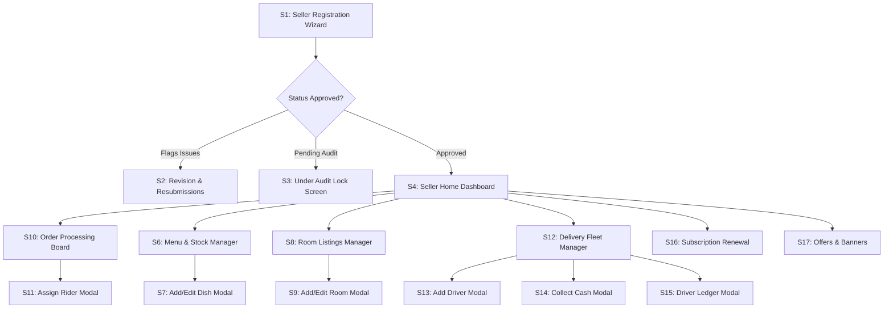
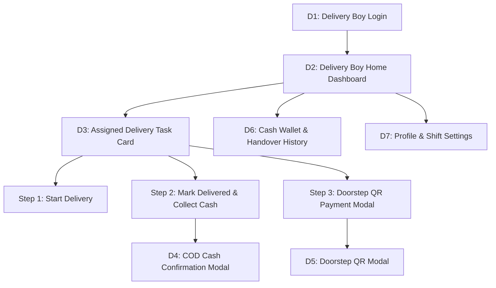

# Neo Cloud Room - Seller & Delivery Partner UI/UX Design Specification

---

## 📌 Introduction for UI/UX Design Team

This document is a non-technical, design-focused guide detailing the **Screen-by-Screen Layouts, Visual Components, Form Attributes, Action Buttons, and User Flows** for two core platform roles:
1. **Seller / Vendor** (Cloud Kitchens, Mess Providers, Bakeries, Property Hosts)
2. **Delivery Partner / Delivery Boy** (Rider Fleet)

Use this guide to build wireframes, visual mockups, Figma components, and UI screen flows.

---

# SECTION 1: SELLER / VENDOR UI/UX SPECIFICATION

---

## 1. Onboarding & Registration Screens

### Screen S1: Seller Registration Wizard (Multi-Step Form)
- **Purpose**: New vendor onboarding and document submission.
- **Visual Design**: Multi-step progress bar (Step 1 of 4 -> Step 4 of 4).
- **UI Sections & Attributes**:
  - **Step 1: Account Setup**
    - Owner Full Name (`Input Field`)
    - Email Address (`Input Field`)
    - Mobile Number (`Input Field with +91`)
    - Password (`Password Input with Show/Hide toggle`)
  - **Step 2: Business & Address Details**
    - Business / Kitchen Name (`Input Field`)
    - Seller Category Selector (`Radio Cards`: Cloud Kitchen / Mess / Bakery)
    - Business Domain (`Checkboxes`: Food Delivery / Property Rental / Both)
    - Dietary Type (`Segmented Control`: Pure Veg / Veg & Non-Veg)
    - Flat / Shop No / Building (`Input Field`)
    - Area / Locality (`Input Field`)
    - Nearby Landmark (`Input Field, Optional`)
    - City (`Input Field`)
    - Pincode (`Input Field, 6-digits`)
  - **Step 3: Document Verification Uploads**
    - Adhaar Card Upload (`File Dropzone` - Front & Back photos)
    - FSSAI License Document (`File Dropzone` - PDF or Image)
    - Electricity / Light Bill (`File Dropzone` - Recent proof of address)
    - Bank Passbook / Cancelled Cheque (`File Dropzone` - For payout verification)
  - **Step 4: Media Gallery Uploads**
    - Kitchen Photos (`Multi-file Dropzone`, Max 3 images)
    - Food / Cuisine Showcase Photos (`Multi-file Dropzone`, Max 3 images)
    - Room / Property Photos (`Multi-file Dropzone`, Max 3 images)
  - **Step 5: Submission Confirmation Card**
    - Store Tracking ID Tag (e.g. `SHOP-X7K2P9` with Copy button)
    - Status Badge: `PENDING AUDIT` (Yellow badge)
    - Message: *"Your application has been submitted and is under verification by our team."*

---

### Screen S2: Revision & Resubmission Screen
- **Trigger**: Displayed when Admin flags the application status as `REVISION`.
- **UI Elements & Attributes**:
  - **Admin Feedback Alert Box** (Red/Amber banner displaying specific revision notes, e.g., *"FSSAI document is blurry. Please upload a clear copy."*).
  - **Resubmission Upload Controls**: Highlighted file upload boxes corresponding only to the flagged documents.
  - **Action Button**: `RESUBMIT APPLICATION FOR AUDIT` (Primary CTA Button).

---

### Screen S3: Application Status / Under Review Screen
- **Trigger**: Vendor logs in while status is `PENDING`.
- **UI Elements**:
  - Lock Screen illustration with a clock icon.
  - Status Badge: `UNDER VERIFICATION`.
  - Application Summary Card: Store Tracking ID, Submitted Date, Business Name.
  - "Contact Platform Support" button.

---

## 2. Store Setup & Daily Operation Screens

### Screen S4: Seller Home Dashboard
- **Top Header Bar**:
  - Store Logo & Business Name.
  - **Store Online / Offline Toggle Switch** (`ON` = Accepting Orders / `OFF` = Store Closed).
  - Subscription Status Badge (e.g., `ACTIVE - 24 Days Left`).
  - Notification Bell Icon.
- **Metrics Summary Cards**:
  - **Today's Revenue**: Amount in ₹ with percentage growth.
  - **Today's Orders**: Number of completed orders.
  - **Pending Orders**: Count of orders waiting for acceptance.
  - **Active Delivery Boys**: Rider fleet count.
- **Subscription Expiry Warning Banner** (Appears if subscription expires in <= 3 days, with a `RENEW NOW` button).
- **Live Incoming Orders Stream**: Card feed of real-time incoming orders with an audio chime toggle.

---

### Screen S5: Operating Hours & Delivery Pincodes Manager
- **Weekly Schedule Section**:
  - Day-by-Day Grid (Monday through Sunday).
  - Per Day Controls: `Open/Closed Switch`, `Opening Time Picker` (HH:MM AM/PM), `Closing Time Picker` (HH:MM AM/PM).
- **Served Pincodes Section**:
  - List of active delivery pincodes displayed as removable chips (`411001 ✖`, `411002 ✖`).
  - `+ Add Delivery Pincode` Input Field + `Add` Button.

---

## 3. Menu & Food Inventory Management Screens

### Screen S6: Food Menu & Stock Manager
- **Header Controls**:
  - Search Bar (`Search dish by name...`).
  - Category Filter Chips (`All`, `Thalis`, `Main Course`, `Snacks`, `Beverages`).
  - Primary CTA Button: `+ ADD NEW DISH`.
- **Food Item Cards**:
  - Dish Image thumbnail.
  - Dish Name & Description.
  - Price Tag (₹).
  - Veg / Non-Veg Indicator Icon (Green dot for Veg / Red triangle for Non-Veg).
  - **Stock Counter Tag**: Displays `Unlimited (-1)` or current counter (e.g. `8 Left`).
  - **Availability Toggle**: `IN STOCK` (Green) / `OUT OF STOCK` (Gray).
  - Action Menu (`Edit Item`, `Delete Item`).

---

### Screen S7: Add / Edit Food Item Modal
- **Form Inputs**:
  - Dish Name (`Text Input`)
  - Dish Description (`Textarea`)
  - Price (`Number Input in ₹`)
  - Food Type (`Radio Buttons`: Veg / Non-Veg)
  - Category (`Dropdown Select`)
  - Sub-Category (`Dropdown Select`)
  - Stock Counter (`Number Input`, enter `-1` for unlimited)
  - Delivery Pincodes (`Tag Input` or comma-separated pincodes)
  - Custom Dish Hours (`Checkbox`: "Custom hours for this dish", with Time Pickers)
  - Dish Photo (`Single Image Upload Dropzone`)
- **Action Buttons**: `SAVE DISH`, `CANCEL`, `DELETE DISH`.

---

## 4. Property & Room Management Screens

### Screen S8: Room Listings & Booking Manager
- **Header**: `+ ADD ROOM LISTING` Button.
- **Room Listing Cards**:
  - Room Photo Carousel.
  - Room Title (e.g. *"Deluxe AC Room #101"*).
  - Capacity Badge (e.g. `2 Guests`).
  - Price per Night Tag (₹).
  - Availability Toggle Switch (`AVAILABLE` / `BOOKED`).
- **Incoming Booking Requests Tab**:
  - Cards displaying Guest Name, Check-in Date, Check-out Date, Total Days, Total Nightly Amount, Status Badge (`PENDING`).
  - Action Buttons: `CONFIRM BOOKING` (Green) | `DECLINE BOOKING` (Red).

---

### Screen S9: Add / Edit Room Listing Modal
- **Form Inputs**:
  - Room Title (`Text Input`)
  - Description & Amenities (`Textarea`)
  - Max Guest Capacity (`Number Selector`)
  - Rate per Night (`Number Input in ₹`)
  - Room Photos (`Multi-Image Upload Dropzone`, Max 5 photos)
  - Availability Switch.
- **Action Buttons**: `SAVE ROOM LISTING`, `CANCEL`.

---

## 5. Order Processing & Fleet Dispatch Screens

### Screen S10: Order Management Board (Tabbed View)
- **Tab Navigation**: `New Orders` | `Preparing` | `Out for Delivery` | `Completed` | `Cancelled`.
- **Order Card Component Attributes**:
  - Order ID Tag (e.g. `#89A12B`)
  - Customer Name & One-Click Call Button
  - Items List (Quantity x Item Name, e.g. `2x Veg Thali`, `1x Lassi`)
  - Full Delivery Address & Customer Pincode
  - Total Amount Tag (₹)
  - Payment Method Badge (`COD` in Orange / `ONLINE PAID` in Green)
  - Order Timestamp
- **Contextual Action Buttons**:
  - On *New Orders* tab -> `ACCEPT & START PREPARING` Button.
  - On *Preparing* tab -> `ASSIGN DELIVERY RIDER` Button.
  - On *Out for Delivery* tab -> Displays Assigned Rider Name & Phone.
  - On *Completed* tab -> `VIEW INVOICE` Button.

---

### Screen S11: Assign Delivery Rider Modal
- **Rider Selector Dropdown**: List of available store delivery boys showing Name, Phone, and Current Active Status.
- **Action Buttons**: `DISPATCH ORDER WITH RIDER`, `CANCEL`.

---

## 6. Delivery Fleet & COD Cash Settlement Screens

### Screen S12: Delivery Fleet Manager Page
- **Header**: `+ ADD DELIVERY BOY` Button, Total Cash Owed Counter (₹).
- **Delivery Driver Table**:
  - Driver Avatar / Profile Icon
  - Driver Name
  - Mobile Number (10 digits)
  - Email Address
  - **Cash Owed Badge** (`outstandingBalance` in ₹, e.g. `₹1,450 Owed`)
  - Driver Active Status Switch (`ACTIVE` / `INACTIVE`)
  - Actions Column: `COLLECT CASH` Button | `VIEW LEDGER` Button.

---

### Screen S13: Add Delivery Boy Modal
- **Form Inputs**:
  - Driver Full Name (`Text Input`)
  - Mobile Number (`10-Digit Number Input`)
  - Email Address (`Text Input`)
  - Login Password (`Password Input`)
  - City (`Text Input`)
  - Pincode (`Text Input`)
- **Action Buttons**: `CREATE DRIVER ACCOUNT`, `CANCEL`.

---

### Screen S14: Collect Cash Settlement Modal
- **Driver Info Header**: Driver Name, Current Cash Owed (`₹1,450`).
- **Cash Collected Input Field**: Enter cash amount handed over by driver (₹).
- **Validation**: Amount must be <= Outstanding Cash Owed.
- **Action Buttons**: `RECORD CASH SETTLEMENT` (Primary CTA), `CANCEL`.

---

### Screen S15: Driver Wallet Ledger Modal
- **Driver Transaction History Table**:
  - Date & Time
  - Transaction Type Badge:
    - `COD CASH COLLECTED` (Green Badge, `+₹450`)
    - `CASH HANDOVER TO SELLER` (Blue Badge, `-₹1,000`)
    - `ADMIN BALANCE ADJUSTMENT` (Purple Badge, `+ / - Amount`)
  - Associated Order ID
  - Amount (₹)
  - Description Notes.

---

## 7. Subscription Plans & Promotional Marketing

### Screen S16: Subscription Plan Activation & Renewal
- **Active Subscription Status Card**: Plan Name, Category (`FOOD` / `PROPERTY` / `BOTH`), Expiration Date, Progress Bar showing days remaining.
- **Subscription Plan Selection Cards**:
  - Monthly & Yearly Plans.
  - Price Tag (₹).
  - Feature Checklist (e.g. ✓ Unlimited Orders, ✓ Priority Listing, ✓ Fleet Management).
- **Subscription Coupon Input Box**: Code Input Field + `APPLY` Button + Discount Summary.
- **CTA Button**: `PAY & RENEW VIA RAZORPAY`.

---

### Screen S17: Offers & Promotional Banner Requests
- **Request Store Discount Coupon Form**:
  - Coupon Code Name (e.g. `FLAT50`)
  - Discount Type (`Percentage %` or `Flat Amount ₹`)
  - Minimum Cart Value (₹)
  - Max Usage Limit per Customer
  - Expiry Date Picker
  - `SUBMIT COUPON FOR APPROVAL` Button.
- **Request Popup Banner Form**:
  - Banner Title
  - Upload Banner Image (Dropzone)
  - Target Redirect Link
  - `SUBMIT BANNER FOR APPROVAL` Button.
- **Approval Status Tracker**: Displays pending approval state (`APPROVED` in Green / `PENDING APPROVAL` in Yellow / `REJECTED` in Red).

---

# SECTION 2: DELIVERY PARTNER / DELIVERY BOY UI/UX SPECIFICATION

---

## 1. Login & Shift Setup Screens

### Screen D1: Delivery Partner Login Screen
- **Header**: Delivery Partner App Logo & Title.
- **Form Inputs**:
  - Registered Mobile Number / Email (`Input Field`)
  - Password (`Password Input`)
- **Action Button**: `LOGIN TO SHIFT` (Primary Full-Width Button).

---

## 2. Active Delivery & Order Dispatch Screens

### Screen D2: Delivery Boy Home Dashboard
- **Top Header Bar**:
  - Rider Name & Profile Avatar.
  - Employing Store / Kitchen Name.
  - **Outstanding Cash Owed Badge**: Prominently displays cash collected owed to store (e.g. `Cash Owed: ₹1,250`).
- **Shift Stats Summary**:
  - Today's Deliveries Completed Count.
  - Active Assigned Orders Count.
- **Assigned Orders Stream**: List of delivery task cards assigned to the rider.

---

### Screen D3: Assigned Delivery Task Card & Order Details
- **Card Component Attributes**:
  - Order ID Tag (e.g. `#89A12B`)
  - Customer Full Name
  - **One-Click Call Customer Button** (Phone icon button)
  - **Open Map Directions Button** (Navigation icon button launching Google Maps)
  - Complete Delivery Address & Locality Pincode
  - Items List Summary (e.g. `2x Veg Meal, 1x Butter Milk`)
  - Payment Method Tag:
    - `COD - COLLECT CASH: ₹450` (Highlighted Orange Badge)
    - `ONLINE PAID` (Green Badge)
- **Sequential Action Buttons**:
  - **Step 1**: `START DELIVERY (OUT FOR DELIVERY)` Button.
  - **Step 2 (For COD)**: `MARK DELIVERED & COLLECT CASH` Button.
  - **Step 2 (For Online Doorstep)**: `DOORSTEP PAYMENT QR` Button.

---

### Screen D4: Doorstep COD Cash Collection Modal
- **Visual Prompt**: Big Cash Received Icon.
- **Amount Confirmation Header**: *"Collect Cash Amount: ₹450 from Customer"*.
- **Confirmation Checkbox**: *"I have collected physical cash from the customer."*
- **Action Buttons**: `CONFIRM CASH RECEIVED & COMPLETE DELIVERY` (Green Primary Button), `CANCEL`.
- **System Outcome**: Adds ₹450 to the rider's `outstandingBalance` badge and updates order status to `DELIVERED`.

---

### Screen D5: Doorstep Online QR Payment Modal
- **Visual Element**: Dynamic Razorpay Payment QR Code displayed on phone screen for customer scanning.
- **Amount Header**: *"Scan QR to Pay: ₹450"*.
- **Live Payment Status Indicator**:
  - *"Waiting for customer payment..."* (Spinner) -> *"Payment Confirmed!"* (Green Checkmark).
- **Action Button**: `CLOSE & COMPLETE DELIVERY`.

---

## 3. Cash Wallet & Ledger Screens

### Screen D6: Cash Wallet & Handover History Screen
- **Top Summary Card**:
  - Total Physical Cash Owed to Store (`outstandingBalance` in ₹).
  - Instruction Box: *"Hand over collected cash to store manager. Manager will log a Cash Settlement to clear your balance."*
- **Transaction History Feed**:
  - List of recent financial transactions:
    - 🟢 `COD Cash Collected` | +₹450 | Order #89A1 | Date & Time
    - 🔵 `Cash Handover to Store` | -₹1,000 | Settlement by Store Manager | Date & Time
    - 🟣 `Admin Balance Adjustment` | +/- Amount | Date & Time.

---

### Screen D7: Rider Profile & Shift Settings
- **Profile Info Card**: Driver Name, Mobile Number, City, Pincode, Employing Seller Store Name.
- **App Version & Help Support Link**.
- **Action Button**: `LOG OUT OF SHIFT` (Red Outline Button).

---

# 📊 Quick Reference Attributes Table for UI Designers

| Role | Screen Name | Key Inputs & Components | Key Action Buttons |
| :--- | :--- | :--- | :--- |
| **Seller** | Registration Wizard | 4-step form, Adhaar/FSSAI/Light Bill/Passbook uploads, store photos. | `SUBMIT APPLICATION` |
| **Seller** | Revision Screen | Highlighted resubmission file boxes, Admin notes alert. | `RESUBMIT FOR AUDIT` |
| **Seller** | Home Dashboard | Online/Offline toggle, Subscription status badge, Revenue cards, Live order feed. | `STORE ONLINE SWITCH` |
| **Seller** | Schedule & Pincodes | Weekly schedule (Mon-Sun) open/close pickers, Served pincodes tag list. | `SAVE SCHEDULE`, `ADD PINCODE` |
| **Seller** | Menu Manager | Food item cards, Stock counter tag, Availability switch, Veg/Non-Veg icons. | `+ ADD NEW DISH` |
| **Seller** | Add/Edit Dish Modal | Name, price, food type, stock (-1 for infinite), category, custom hours, photo. | `SAVE DISH` |
| **Seller** | Order Board | Kanban/Tabbed view (New, Preparing, Out for Delivery, Completed), COD/Paid badges. | `ACCEPT`, `ASSIGN RIDER` |
| **Seller** | Fleet Manager | Rider table, Phone (10-digits), Email, Cash owed badge (`outstandingBalance`). | `+ ADD DELIVERY BOY`, `COLLECT CASH` |
| **Seller** | Cash Collect Modal | Driver selector, Cash Owed header, Cash collected input field. | `RECORD CASH SETTLEMENT` |
| **Seller** | Subscriptions | Plan cards, Features checklist, Coupon input box, Discount summary. | `PAY VIA RAZORPAY` |
| **Rider**  | Rider Dashboard | Cash Owed badge header, Shift stats, Assigned delivery task cards. | `START DELIVERY` |
| **Rider**  | Task Card | Order ID, Customer name, Call button, Map button, Items summary, COD badge. | `COLLECT CASH & MARK DELIVERED` |
| **Rider**  | COD Cash Modal | Cash amount header, Checkbox confirmation. | `CONFIRM CASH RECEIVED` |
| **Rider**  | Doorstep QR Modal | Dynamic Razorpay QR code display, Real-time status spinner. | `COMPLETE DELIVERY` |
| **Rider**  | Cash Wallet | Outstanding cash owed header, Transaction history feed (COD +, Handover -). | `VIEW LEDGER` |

---
*UI/UX Specification Document prepared for the **Neo Cloud Room** Design & Wireframing Team.*
