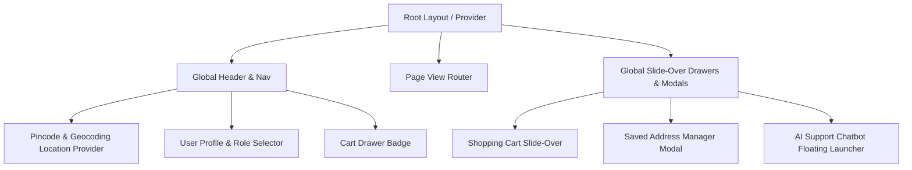
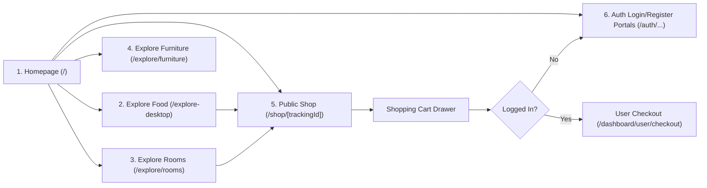
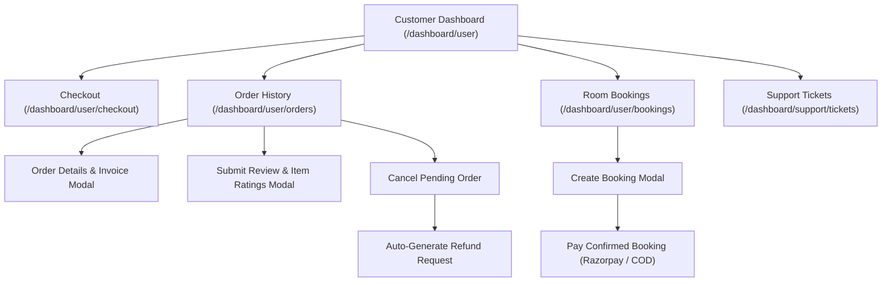
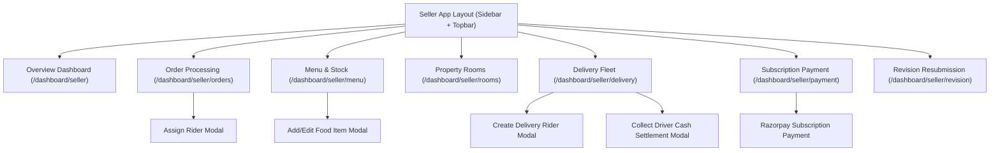
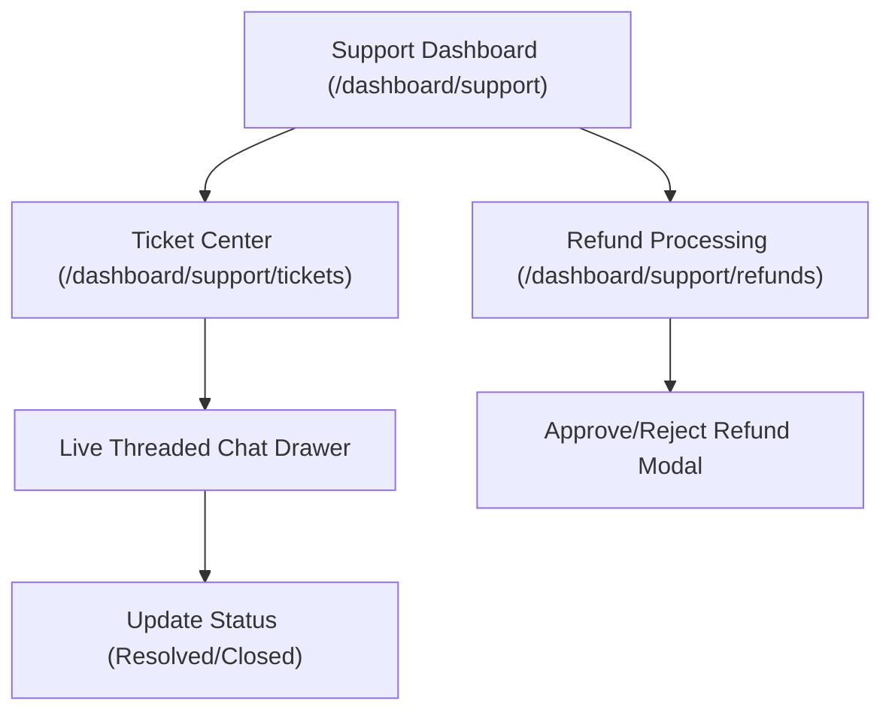
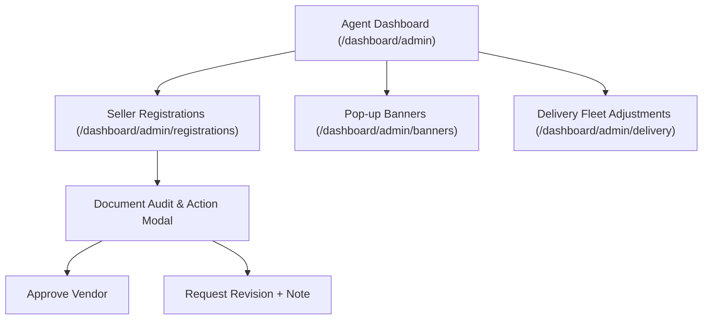
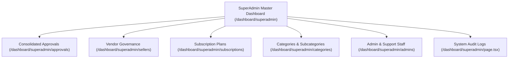
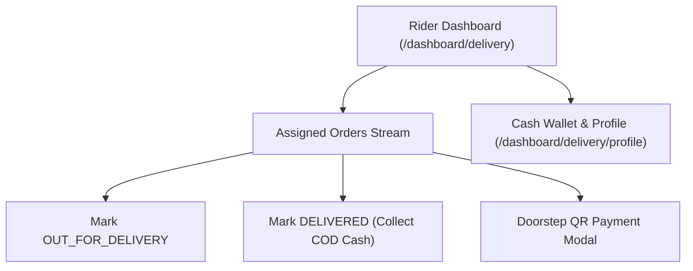

# Neo Cloud Room - UI/UX Screen-Level User Flow & Component Specification

---

## 1. Document Overview & UI Architecture Guidelines

This document provides a comprehensive, screen-by-screen specification of user flows, navigation hierarchies, page components, forms, modals, actions, and state transitions for the **Neo Cloud Room (CloudKitchen)** platform. It serves as the authoritative blueprint for the UI/UX and Frontend Engineering teams.

### System User Roles Covered
1. **Unauthenticated / Public Visitors**
2. **User / Customer** (`USER`)
3. **Seller / Vendor** (`SELLER` - Cloud Kitchen, Mess, Bakery, Room Host)
4. **Delivery Person / Rider Fleet** (`DELIVERY`)
5. **Support Staff** (`SUPPORT` - Customer Support & Refund Audit Operations)
6. **Field Agent / Branch Administrator** (`AGENT`)
7. **SuperAdmin** (`SUPERADMIN` - Master Platform Administrator)

---

## 2. Global UI Layouts & Shared Modal Specifications

### Shared Global UI Components
- **Location Provider Header (`location-provider.tsx`)**: Displays current selected pincode and city; triggers the Address Selector / Geocoding Map Modal.
- **Cart Slide-Over Drawer (`cart-buttons.tsx`)**: Displays cart items, quantity counters (`+` / `-`), seller store info, subtotal, and proceeds to Checkout.
- **Store Status Banner (`store-status-toggle.tsx`)**: Header component allowing sellers to toggle store Online/Offline state (`isOnline`).
- **Subscription Gate Banner (`subscription-gate.tsx`)**: Sticky warning banner displayed to vendors when their subscription is inactive or expiring within 3 days.
- **Popup Promotional Banner Overlay (`PopupBannerDisplay.tsx`)**: Renders promotional popup banners triggered on homepage/store view.
- **Chatbot Floating Widget (`chatbot-widget.tsx`)**: Persistent floating action button on public/customer views launching the AI assistant drawer.

---

## 3. Public & Unauthenticated User Screen Flows

### 3.1 Screen: Homepage (`/`)
- **Route**: `src/app/page.tsx`
- **UI Elements**:
  - Global Navigation Header (Logo, Location Selector, Search Bar, Category Links, Cart Trigger, Login Dropdown).
  - Dynamic Promotional Carousel / Banner Section (`PopupBannerDisplay.tsx`).
  - Service Category Selector Cards: Food Kitchens, Mess Services, Bakery, Property Rooms, Furniture.
  - Pincode-Filtered Store Grid: Cards displaying Store Banner, Business Name, Rating Badge, Distance/Locality, Food Type Tag (`VEG` / `BOTH`), and Open/Closed status.
- **User Actions**:
  - Click Location Header -> Opens Location Map/Pincode Modal.
  - Click Category Card -> Navigates to `/explore/[category]`.
  - Click Vendor Store Card -> Navigates to `/shop/[trackingId]`.

### 3.2 Screen: Catalog Exploration Pages
- **Routes**:
  - `/explore-desktop`: Food items grid with Veg/Non-Veg toggle, category tags, price slider, and operating hours status.
  - `/explore/rooms`: Property listings grid with capacity filter, nightly price filter, and date picker.
  - `/explore/furniture`: Furniture items gallery with "Inquire Details" button opening a direct store query modal.

### 3.3 Screen: Public Vendor Shop Page (`/shop/[trackingId]`)
- **Route**: `src/app/shop/[trackingId]/page.tsx`
- **UI Elements**:
  - Vendor Cover Banner, Business Logo, Store Name, Verification Badge, Food Type Tag, Rating Summary, Full Locality Address, UPI ID badge.
  - Operational Hours Card (Displays daily schedule and current Open/Closed status).
  - Tab Bar: `Food Menu` | `Room Listings` | `Reviews & Ratings`.
  - Food Menu Grid: Dish Card with Dish Image, Name, Category, Price, Veg/Non-Veg icon, Operational Time Tag, Stock Quantity indicator, and `+ ADD TO CART` button.
- **User Actions**:
  - Click `+ ADD TO CART` -> Increments item count in Cart Drawer.
  - Click Item Card -> Opens Dish Detail Modal.

### 3.4 Screen: Authentication & Registration Portal Routes
- **Routes**:
  - `/auth/login`: Customer login form (Email, Password, Remember Me, Submit, Google OAuth, Link to Register).
  - `/auth/login/seller`: Vendor login form.
  - `/auth/login/admin`: Admin, Agent, Superadmin, and Support Staff login portal.
  - `/auth/login/delivery`: Delivery Rider login form.
  - `/auth/register`: Onboarding role selection page ("Register as Customer" vs "Register as Vendor").
  - `/auth/register/user`: Customer registration form (Name, Email, Phone, City, Pincode, Password).
  - `/auth/register/page`: Multi-Step Vendor Registration Wizard:
    - **Step 1: Account Info**: Owner Name, Email, Phone, Password, Seller Role.
    - **Step 2: Business Info**: Business Name, Seller Type (Homely Food, Mess, Bakery), Category (`FOOD`, `PROPERTY`, `BOTH`), Food Type (`VEG`, `BOTH`), Address Flat, Locality, Landmark, City, Pincode.
    - **Step 3: Identity & Legal Proofs**: Upload inputs for Adhaar Front File, Adhaar Back File, FSSAI License File, Electricity/Light Bill, Bank Passbook.
    - **Step 4: Store Photo Galleries**: Upload inputs for Kitchen Images (Max 3), Cuisine Images (Max 3), Room Images (Max 3).
    - **Step 5: Confirmation**: Summary display + Submission button -> Generates unique Store Tracking ID (e.g. `SHOP-X7K2P9`) and routes to PENDING status screen.

---

## 4. User / Customer Screen Flows (`/dashboard/user/...`)

### 4.1 Screen: Customer Overview Dashboard (`/dashboard/user`)
- **Route**: `src/app/dashboard/user/page.tsx`
- **UI Elements**:
  - Welcome Banner with User Name and Current Location Pincode.
  - Stat Cards: Active Orders, Upcoming Bookings, Saved Addresses count.
  - Recent Orders Widget: Card view of recent 3 orders with status badges (`PENDING`, `PREPARING`, `OUT_FOR_DELIVERY`, `DELIVERED`).

### 4.2 Screen: Food Order Checkout Page (`/dashboard/user/checkout`)
- **Route**: `src/app/dashboard/user/checkout/page.tsx`
- **UI Elements**:
  - Delivery Address Selector: Cards for saved addresses (Home/Work/Other) with pincode and default badge; "+ Add New Address" button opening Geocoding Map Modal (`house-map-picker.tsx`).
  - Order Items Summary: List of cart items with quantity controls, unit price, item subtotal, and stock availability badge.
  - Promotional Coupon Box: Input field for discount code + `APPLY` button. Displays applied discount amount and eligibility error messages (e.g., minimum cart value required).
  - Operational & Pincode Checks Banner: Warns if any item is closed or undeliverable to the selected address.
  - Payment Method Selector: Radio options for `Cash on Delivery (COD)` vs `Online Payment (Razorpay)`.
  - Order Financial Breakdown: Items Subtotal, Taxes & Delivery Fee, Coupon Discount, Total Amount.
  - `PLACE ORDER` Action Button.
- **State Transitions**:
  - If `Online Payment` -> Triggers Razorpay payment modal -> On success, calls `/api/user/orders/verify` -> Redirects to Order Details page.
  - If `COD` -> Creates order directly -> Redirects to Order History page.

### 4.3 Screen: Order History & Invoice Page (`/dashboard/user/orders`)
- **Route**: `src/app/dashboard/user/orders/page.tsx` & `/invoice/order/[id]/page.tsx`
- **UI Elements**:
  - Filter Tabs: `All Orders` | `Active` | `Completed` | `Cancelled`.
  - Order Card List: Order ID (Short Hash), Store Name, Date/Time, Items Summary, Total Amount, Payment Status Badge (`PAID` vs `UNPAID`), Order Status Badge (`PENDING`, `PREPARING`, `OUT_FOR_DELIVERY`, `DELIVERED`, `CANCELLED`).
  - Action Buttons on Cards:
    - `View Details` -> Opens Order Details Slide-Over (Assigned rider info, delivery address, itemized breakdown).
    - `Download Invoice` -> Navigates to printable HTML Tax Invoice (`/invoice/order/[id]`).
    - `Cancel Order` -> Available only when status is `PENDING`. Confirms cancellation, restores inventory, and auto-queues refund if prepaid.
    - `Write Review` -> Available when status is `DELIVERED`. Opens Review & Item Rating Modal.
- **Review & Item Rating Modal**:
  - Overall Order Rating: 1 to 5 Star selector + Written Feedback Textarea.
  - Dish-Specific Ratings: List of ordered food items, each with 1 to 5 Star selector and item comment field.

### 4.4 Screen: Property Room Bookings (`/dashboard/user/bookings`)
- **Route**: `src/app/dashboard/user/bookings/page.tsx`
- **UI Elements**:
  - Bookings List: Property Name, Room Title, Check-in Date, Check-out Date, Total Nightly Amount, Booking Status (`PENDING`, `CONFIRMED`, `CANCELLED`), Payment Status.
  - Action Buttons:
    - `Pay Now` -> Enabled when status is `CONFIRMED` and `isPaid == false`. Launches Razorpay Checkout or confirms COD payment.
    - `Request Cancellation` -> Cancels pending/confirmed booking and submits refund request if paid.

---

## 5. Seller / Vendor Screen Flows (`/dashboard/seller/...`)

### 5.1 Screen: Seller Dashboard Overview (`/dashboard/seller`)
- **Route**: `src/app/dashboard/seller/page.tsx`
- **UI Elements**:
  - Top Bar: Store Status Toggle (`store-status-toggle.tsx`), Subscription Gate Warning Banner (`subscription-gate.tsx`).
  - Stat Widgets: Today's Revenue, Total Orders Completed, Active Subscriptions Expiry Date, Delivery Riders Active Count.
  - Live Order Queue Widget: Real-time incoming orders list with sound notification alert.

### 5.2 Screen: Revision Resubmission Page (`/dashboard/seller/revision`)
- **Route**: `src/app/dashboard/seller/revision/page.tsx`
- **Condition**: Automatically activated when vendor `verificationStatus == REVISION`.
- **UI Elements**:
  - Alert Banner displaying Administrator Revision Notes (`verificationNote`).
  - Resubmission Form: File inputs for resubmitting updated Adhaar Front/Back, FSSAI License, Electricity Bill, Bank Passbook, Kitchen, Cuisine, or Room photos.
  - `RESUBMIT FOR VERIFICATION` Action Button -> Resets status to `PENDING` for re-auditing.

### 5.3 Screen: Order Management & Rider Assignment (`/dashboard/seller/orders`)
- **Route**: `src/app/dashboard/seller/orders/page.tsx`
- **UI Elements**:
  - Tabbed Order Board: `Pending` | `Preparing` | `Out for Delivery` | `Completed` | `Cancelled`.
  - Order Processing Card: Order ID, Customer Name, Phone, Items List, Delivery Address, Total Amount, Payment Badge (`COD` vs `ONLINE`).
  - Status Action Buttons:
    - `Accept & Start Preparing` -> Changes status `PENDING` -> `PREPARING`.
    - `Assign Rider & Dispatch` -> Opens Assign Rider Modal. Selects rider from active delivery fleet -> Updates status to `OUT_FOR_DELIVERY`.
    - `Mark Delivered` -> Used for direct store delivery -> Updates status to `DELIVERED`.

### 5.4 Screen: Menu & Food Inventory Management (`/dashboard/seller/menu`, `/dashboard/seller/inventory`)
- **Route**: `src/app/dashboard/seller/menu/page.tsx` & `/dashboard/seller/inventory/page.tsx`
- **UI Elements**:
  - Food Category Tabs & Add New Item Button.
  - Food Item Grid: Image, Name, Price, Veg/Non-Veg Tag, Stock Counter Badge (-1 for infinite, or numeric counter), Availability Toggle Switch.
  - **Add / Edit Food Item Modal**:
    - Item Name, Description, Price, Food Type (`VEG` / `NON_VEG`).
    - Stock Quantity (-1 for unlimited, or numeric value).
    - Category & Sub-category selectors.
    - Delivery Pincodes Input (Comma-separated pincodes).
    - Operational Hours Editor: Weekly schedule grid (Mon-Sun) with `isOpen` checkboxes and `openTime` / `closeTime` time pickers.
  - **Served Pincodes Manager Modal**: Add or delete pincodes served by the kitchen.

### 5.5 Screen: Property & Room Management (`/dashboard/seller/rooms`)
- **Route**: `src/app/dashboard/seller/rooms/page.tsx`
- **UI Elements**:
  - Room Listings Grid: Room Photo Carousel, Title, Nightly Price, Capacity, Availability Toggle.
  - **Add / Edit Room Modal**: Title, Description, Capacity, Nightly Price, Multi-photo upload inputs, Availability toggle.
  - Room Bookings Tab: List incoming booking requests (`PENDING`), `CONFIRM BOOKING` button, `CANCEL BOOKING` button.

### 5.6 Screen: Delivery Fleet & COD Settlement (`/dashboard/seller/delivery`)
- **Route**: `src/app/dashboard/seller/delivery/page.tsx`
- **UI Elements**:
  - Delivery Drivers Table: Driver Name, 10-digit Phone, Email, Outstanding COD Cash Balance badge, Status (`ACTIVE` / `INACTIVE`).
  - **Create Delivery Person Modal**: Form fields for Name, 10-digit Phone (validated regex `^[0-9]{10}$`), Email, Password, City, Pincode.
  - **Collect Cash Settlement Modal**: Selects rider, displays current `outstandingBalance`, input field for cash collected (must be > ₹1 and <= outstanding balance), `SUBMIT SETTLEMENT` button -> Logs `SETTLEMENT` transaction and decrements driver balance.
  - Driver Transaction History Modal: Displays ledger of rider's `COD_COLLECTION` (+), `SETTLEMENT` (-), and `ADJUSTMENT` (+/-) transactions.

### 5.7 Screen: Subscription Plans & Payment (`/dashboard/seller/payment`)
- **Route**: `src/app/dashboard/seller/payment/page.tsx`
- **UI Elements**:
  - Current Active Subscription Card: Plan Name, Category (`FOOD`/`PROPERTY`/`BOTH`), Expiry Date, Days Remaining.
  - Plan Selector Cards: Monthly/Yearly Plans with feature checkmarks and prices.
  - Subscription Coupon Code Input + `APPLY COUPON` button.
  - Final Discounted Price Calculation display + `PAY WITH RAZORPAY` button.
- **State Transition**: Upon successful Razorpay payment verification, plan validity stacks from current expiration date and unlocks store operations.

---

## 6. Support Staff Screen Flows (`/dashboard/support/...`)

### 6.1 Screen: Support Ticket Resolution Center (`/dashboard/support/tickets`)
- **Route**: `src/app/dashboard/support/tickets/page.tsx`
- **UI Elements**:
  - Category Filter Tabs: `All` | `Food` | `Room` | `Payment` | `Other`.
  - Status Filter Tabs: `OPEN` | `IN_PROGRESS` | `RESOLVED` | `CLOSED`.
  - Ticket List Table: Ticket ID, Customer Name, User Role, Issue Title, Category Badge, Last Updated Timestamp, Status Badge.
  - **Threaded Live Chat Drawer**:
    - Header: Ticket ID, Title, User Info, Status Dropdown.
    - Chat History Stream: Scrollable message list with timestamped bubbles (User messages vs Support Staff replies).
    - Reply Composer: Textarea + `SEND REPLY` button.
    - `MARK RESOLVED` / `CLOSE TICKET` Action Buttons.

### 6.2 Screen: Refund Audit & Financial Fulfillment (`/dashboard/support/refunds`)
- **Route**: `src/app/dashboard/support/refunds/page.tsx`
- **UI Elements**:
  - Refund Requests Table: Refund ID, User Name & Email, Order / Booking ID, Requested Amount (₹), Reason, Status (`PENDING`, `APPROVED`, `REJECTED`), Date.
  - **Refund Action Modal**:
    - Displays Order/Booking details and proof of payment.
    - Input Field: Bank Transaction Reference ID (`transactionId`).
    - Input Field: Administrative Notes (`adminNote`).
    - Action Buttons: `APPROVE REFUND` (Updates refund status `APPROVED`, sets order `isPaid = false` or booking `status = CANCELLED`) vs `REJECT REFUND` (Updates refund status `REJECTED`).

---

## 7. Field Agent / Admin Screen Flows (`/dashboard/admin/...`)

### 7.1 Screen: Seller Document Verification & Audit (`/dashboard/admin/registrations`)
- **Route**: `src/app/dashboard/admin/registrations/page.tsx`
- **UI Elements**:
  - Pending Vendors List: Business Name, Owner Name, Contact Phone, City, Tracking ID, Category (`FOOD`/`PROPERTY`/`BOTH`), Verification Status.
  - **Document Inspection Modal**:
    - Tabbed Gallery: `Adhaar Front/Back` | `FSSAI License` | `Electricity Bill` | `Passbook` | `Kitchen Photos` | `Room Photos`.
    - Verification Feedback Textarea (`verificationNote`).
    - Action Buttons:
      - `APPROVE SELLER`: Sets `verificationStatus = APPROVED` and category verification status to `APPROVED`.
      - `REQUEST REVISION`: Requires feedback note entry; sets `verificationStatus = REVISION`.
      - `REJECT SELLER`: Sets `verificationStatus = REJECTED`.

### 7.2 Screen: Delivery Driver Wallet Adjustments (`/dashboard/admin/delivery`)
- **Route**: `src/app/dashboard/admin/delivery/page.tsx`
- **UI Elements**:
  - Drivers Wallet Overview Table: Rider Name, Phone, Employing Seller Name, Current Outstanding Balance (₹).
  - **Balance Adjustment Modal**:
    - Adjustment Type Selector: `INCREMENT` (Increase cash owed) vs `DECREMENT` (Decrease cash owed).
    - Amount Input field (₹).
    - Reason Description Textarea (`description`).
    - `SUBMIT ADJUSTMENT` Button -> Creates `ADJUSTMENT` delivery transaction and updates rider balance.

---

## 8. SuperAdmin Screen Flows (`/dashboard/superadmin/...`)

### 8.1 Screen: Master System Dashboard (`/dashboard/superadmin`)
- **Route**: `src/app/dashboard/superadmin/page.tsx`
- **UI Elements**:
  - Platform System Metrics: Gross Revenue, Total Active Sellers, Total Customers, Active Subscriptions Revenue, System Audit Log Feed.

### 8.2 Screen: Consolidated Approvals Engine (`/dashboard/superadmin/approvals`)
- **Route**: `src/app/dashboard/superadmin/approvals/page.tsx`
- **UI Elements**:
  - Tabs: `Pending Pop-up Banners` | `Pending Store Coupons`.
  - Item Inspection Cards: Title, Banner Image preview / Coupon Discount details, Seller Name, Created Date.
  - Action Buttons: `APPROVE` | `REJECT` | `REQUEST REVISION` (with admin note).

### 8.3 Screen: Subscription Plans & Coupons Manager (`/dashboard/superadmin/subscriptions`)
- **Route**: `src/app/dashboard/superadmin/subscriptions/page.tsx`
- **UI Elements**:
  - Active Plans Table & Active Subscription Coupons Table.
  - **Create / Edit Plan Modal**: Plan Name, Monthly Price, Duration (Months), Category (`FOOD`/`PROPERTY`/`BOTH`), Features JSON editor.
  - **Create / Edit Subscription Coupon Modal**: Code, Discount %, Discount Amount, Target Plan, Max Usages cap, Expiry Date.

### 8.4 Screen: Food Categories & Taxonomy Editor (`/dashboard/superadmin/categories`)
- **Route**: `src/app/dashboard/superadmin/categories/page.tsx`
- **UI Elements**:
  - Top Categories Table & Food Sub-Categories Tree View.
  - **Create Category Modal**: Category Name, Type (`FOOD` vs `ROOM`).
  - **Create Food Sub-Category Modal**: Sub-category Name, Parent Category select, Image Upload.

### 8.5 Screen: Staff & Agent Account Management (`/dashboard/superadmin/admins`)
- **Route**: `src/app/dashboard/superadmin/admins/page.tsx`
- **UI Elements**:
  - Administrative Accounts Table: Staff Name, Email, Role (`AGENT` vs `SUPPORT`), Assigned Sellers count, Active status.
  - **Create Admin / Support Staff Modal**:
    - Form Fields: Name, Email, Password, Role Dropdown (`AGENT` vs `SUPPORT`).
    - Agent Permission Checkboxes: `Can Manage Offers`, `Can Manage Banners`.
    - `CREATE ACCOUNT` Action Button.

---

## 9. Delivery Rider Screen Flows (`/dashboard/delivery/...`)

### 9.1 Screen: Delivery Rider Dashboard & Orders Stream (`/dashboard/delivery`)
- **Route**: `src/app/dashboard/delivery/page.tsx`
- **UI Elements**:
  - Header: Rider Name, Employing Seller Name, Outstanding COD Cash Balance (₹).
  - Assigned Orders Cards: Order ID, Customer Name, Contact Phone, Delivery Address, Items List, Payment Method (`COD` vs `ONLINE`), Total Amount.
  - Action Buttons:
    - `Start Delivery` -> Updates order status to `OUT_FOR_DELIVERY`.
    - `Mark Delivered (Collect COD Cash)` -> Triggers confirmation modal -> Sets status to `DELIVERED`, marks `isPaid = true`, increments rider `outstandingBalance` by total amount, and creates `COD_COLLECTION` transaction.
    - `Doorstep Online QR` -> Generates Razorpay QR code for customer to scan and pay at doorstep.

### 9.2 Screen: Rider Cash Wallet & Profile (`/dashboard/delivery/profile`)
- **Route**: `src/app/dashboard/delivery/profile/page.tsx`
- **UI Elements**:
  - Outstanding Balance Indicator (Displays physical cash owed to employing seller).
  - Cash Transaction History Ledger Table: Date, Transaction Type (`COD_COLLECTION` [+], `SETTLEMENT` [-], `ADJUSTMENT` [+/-]), Order ID, Amount, Description.
  - Profile Form: Edit Phone Number, City, Pincode.

---

## 10. Complete Screen Route Mapping Table

| Role | Screen Name | Route Path | Primary Actions & State Transitions |
| :--- | :--- | :--- | :--- |
| **Public** | Homepage | `/` | Explore categories, filter stores by pincode, view popup banners. |
| **Public** | Vendor Shop Page | `/shop/[trackingId]` | View store menu/rooms, add items to cart drawer, check open hours. |
| **Auth** | Customer Register | `/auth/register/user` | Register new customer account. |
| **Auth** | Vendor Register Wizard | `/auth/register/page` | 5-step vendor registration with document & photo uploads. |
| **User** | Customer Dashboard | `/dashboard/user` | View active orders summary, bookings count, saved addresses. |
| **User** | Food Checkout | `/dashboard/user/checkout` | Select delivery address, validate coupon, choose COD/Razorpay. |
| **User** | Order History & Invoice | `/dashboard/user/orders` | View order status, download invoice, cancel pending order, submit review. |
| **User** | Room Bookings | `/dashboard/user/bookings` | Request room dates, track approval, pay confirmed booking. |
| **Seller** | Seller Overview | `/dashboard/seller` | Revenue analytics, store Online/Offline toggle, live order stream. |
| **Seller** | Profile Revision | `/dashboard/seller/revision` | Resubmit corrected documents when profile is in `REVISION` state. |
| **Seller** | Order Processing | `/dashboard/seller/orders` | Accept orders, start preparing, assign delivery rider, dispatch. |
| **Seller** | Menu & Inventory | `/dashboard/seller/menu` | Add/edit dishes, operational hours schedule, stock counters, pincodes. |
| **Seller** | Fleet & COD Settlement | `/dashboard/seller/delivery` | Create riders, collect cash settlements, inspect driver wallet ledger. |
| **Seller** | Subscriptions | `/dashboard/seller/payment` | Select plan, apply subscription coupon, complete Razorpay payment. |
| **Support**| Ticket Center | `/dashboard/support/tickets` | View all user/vendor tickets, live threaded chat, update ticket status. |
| **Support**| Refund Audit | `/dashboard/support/refunds` | Audit refund claims, enter bank reference ID, approve or reject refunds. |
| **Agent**  | Vendor Verification | `/dashboard/admin/registrations` | Audit vendor docs/photos, approve vendor, request revision with notes. |
| **Agent**  | Fleet Adjustments | `/dashboard/admin/delivery` | Adjust rider outstanding balances (`INCREMENT`/`DECREMENT`). |
| **Super**  | Approvals Engine | `/dashboard/superadmin/approvals` | Consolidated audit for seller coupons and global popup banners. |
| **Super**  | Subscription Plans | `/dashboard/superadmin/subscriptions` | Create/edit subscription plans and subscription discount coupons. |
| **Super**  | Staff Governance | `/dashboard/superadmin/admins` | Create Agent and Support Staff accounts with granular permissions. |
| **Rider**  | Rider Dashboard | `/dashboard/delivery` | View assigned orders, mark out for delivery, mark delivered (collect COD). |
| **Rider**  | Wallet Ledger | `/dashboard/delivery/profile` | View outstanding cash balance, track cash settlements & adjustments. |

---
*UI/UX Screen-Level User Flow Specification compiled for the **Neo Cloud Room** Design & Development Team.*
